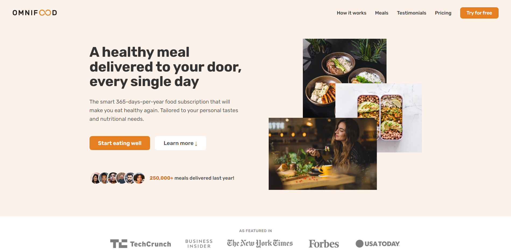
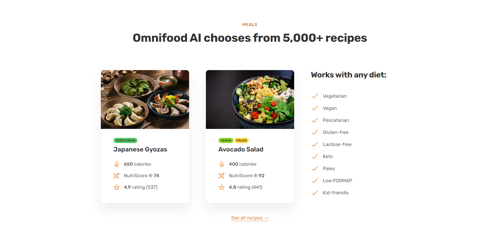
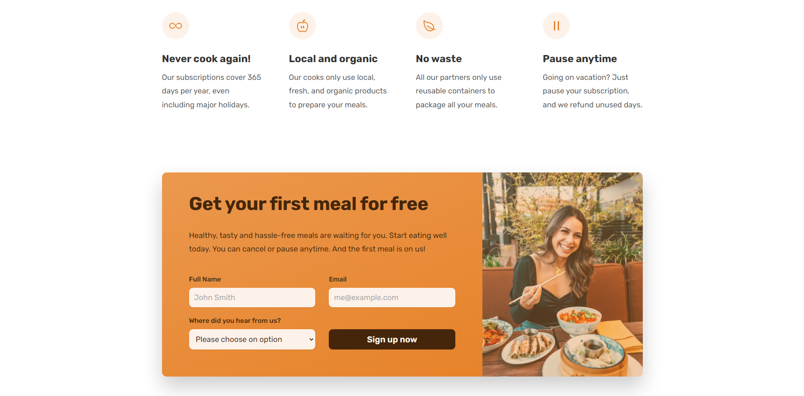

# Omnifood Project

This project is based on the "Build Responsive Real World Websites with HTML5 and CSS3" course by Jonas Schmedtmann. It is a website for a fictional food delivery service called Omnifood.

## Table of Contents

- [Project Overview](#project-overview)
- [Functionality](#functionality)
- [Screenshots](#screenshots)
- [Installation](#installation)
- [Acknowledgments](#acknowledgments)

## Project Overview

The Omnifood website is designed to be responsive and accessible on a range of devices, from desktop computers to mobile phones. It features a clean and modern design, with bold typography and high-quality images.

## Functionality

The website includes several key features, including:

- A responsive layout that adapts to different screen sizes
- A dynamic navigation menu that changes based on the user's scrolling position
- A smooth-scrolling feature that animates scrolling between sections
- Interactive elements such as buttons and hover effects

## Screenshots

Here are some screenshots of the Omnifood website:

*The homepage of the Omnifood website*

*The meals section of the Omnifood website*

*The CTA section of the Omnifood website*

## Installation

To run the Omnifood project locally, follow these steps:

1. Clone the repository to your local machine.
2. Open the index.html file in your web browser.

## Acknowledgments

This project is based on the "Build Responsive Real World Websites with HTML5 and CSS3" course by Jonas Schmedtmann. You can find more information about the course at [https://www.udemy.com/course/design-and-develop-a-killer-website-with-html5-and-css3/](https://www.udemy.com/course/design-and-develop-a-killer-website-with-html5-and-css3/).
